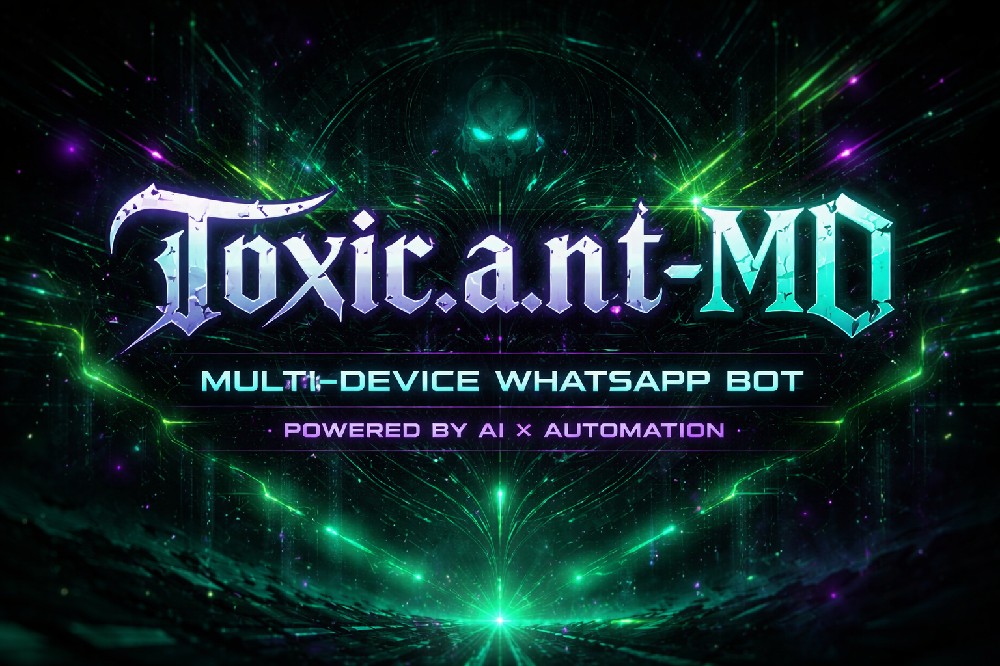

# 𝕿𝖔𝖝𝖎𝖈.𝖆.𝖓.𝖙-MD

  

  

  

## 📱 CONTACT ME

This bot is created with NodeJS and powered by [Baileys](https://github.com/whiskeysockets/Baileys)

  

## ⚠️ DISCLAIMER
Modifying the bot structure is at your own risk. We do not provide technical support for errors caused by unauthorized changes.

  

## 🚀 FEATURES
- Multi-device WhatsApp bot  
- Group management tools  
- Media commands: audio, video, downloads, stickers  
- AI commands with ChatGPT integration  
- Fun & Games: jokes, quotes, anime content, and more  
- Customizable prefix, modes, and settings  
- ⚠️ Some AI APIs may occasionally be down  

  

## 🛠 SETUP

### 1️⃣ Fork this repo

### 2️⃣ Pair on Render

### 3️⃣ Deploy

  

## 🎖 CREDITS

## 📜 LICENSE
MIT License  
Copyright (c) 2025 𝕿𝖔𝖝𝖎𝖈.𝖆.𝖓.𝖙-MD

  

**Bot Git:** [https://github.com/Toxicant1/Toxic.a.n.t-MD](https://github.com/Toxicant1/Toxic.a.n.t-MD)